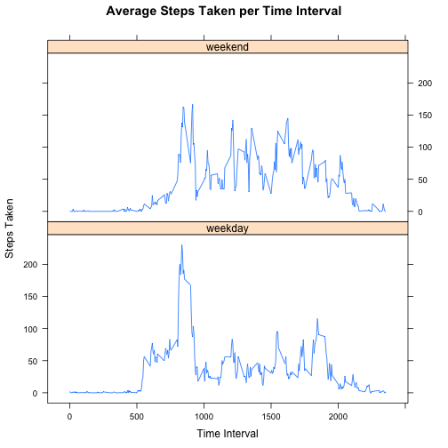

# Reproducible Research: Peer Assessment 1
============================================

## Loading and preprocessing the data

1) LOAD THE DATA

```r
library(plyr)
library(lattice)

data <-read.csv('./activity.csv')
```
2) PROCESS AND TRANSFORMATION  
*No further processing or transformation was required on the data*

## What is mean total number of steps taken per day?

1) BUILD HISTOGRAM OF TOTAL NUMBER OF STEPS TAKEN EACH DAY

```r
# sum daily steps taken
daily_data<-ddply(data,'date',summarise, steps=sum(steps,na.rm=TRUE))
hist(daily_data$steps, xlab='Number of Steps', 
     main='Total Number of Steps Taken Each Day')
```

 

2)  CALCULATE THE MEAN AND MEDIAN TOTAL NUMBER OF STEPS TAKEN PER DAY

```r
#calc mean
mean(daily_data$steps, na.rm=TRUE)
```

```
## [1] 9354
```

```r
#calc median
median(daily_data$steps, na.rm=TRUE)
```

```
## [1] 10395
```

## What is the average daily activity pattern?
1)  BUILD TIME SERIES PLOT OF THE 5 MINUTE INTERVALS, AVERAGED ACROSS ALL DAYS

```r
interval_data<-ddply(data,'interval', summarise, steps=mean(steps, na.rm=TRUE))
with(interval_data, plot(interval, steps, type='l', xlab='Time Interval', 
     ylab='Steps Taken', main='Average Steps Taken per Time Interval'))
```

 

2)  DETERMINED THE 5 MINUTE INTERVAL WITH THE MAXIMUM NUMBER OF STEPS

```r
# calc interval with highest number of steps
interval_data[which.max(interval_data$steps),]
```

```
##     interval steps
## 104      835 206.2
```


## Imputing missing values
1) CALCULATE TOTAL NUMBER OF MISSING VALUES IN THE DATASET
 
 
 ```r
     sum(is.na(data$steps))
 ```
 
 ```
 ## [1] 2304
 ```

2) STRATEGY USED FOR FILLING IN THE MISSING VALUES (NAs):
     *Missing values were estimated by using the intervals average value
     across all days.*

3) CREATE NEW DATASET WITH THE MISSING VALUES FILLED IN

```r
imp_data<-merge(data, interval_data, by.x='interval', by.y='interval')
imp_data$steps.x<-ifelse(is.na(imp_data$steps.x), 
                         imp_data$steps.y, 
                         imp_data$steps.x)
imp_data<-imp_data[,c(2,3,1)]
colnames(imp_data)<-c('steps','date','interval')
imp_data<-imp_data[order(imp_data$date, imp_data$interval),]
row.names(imp_data)<-NULL
```

4) BUILD ADDITIONAL HISTOGRAM OF AVERAGE STEPS TAKEN PER DAY 


```r
daily_imp_data<-ddply(imp_data,'date',summarise, steps=sum(steps,na.rm=TRUE))
hist(daily_imp_data$steps, 
     xlab='Number of Steps', 
     main='Total Number of Steps Taken Each Day')
```

 

4a) CALCULATE THE MEAN AND MEDIAN TOTAL NUMBER OF STEPS TAKEN PER DAY


```r
#calc mean
mean(daily_imp_data$steps, na.rm=TRUE)
```

```
## [1] 10766
```

```r
#calc median
median(daily_imp_data$steps, na.rm=TRUE)
```

```
## [1] 10766
```

4b) 
* Note: Oberserved mean and median values differ from 
 original when imputed data values are used 

4c)
* Note: Observed mean and median values are signficantly higher from 
 original estimates when imputed data values are used 


## Are there differences in activity patterns between weekdays and weekends?

1) CREATE FACTOR VARIABLE TO SEPERATE WEEKDAYS VERSUS WEEKENDS


```r
imp_data$dayofweek<-weekdays(as.Date(imp_data$date))

imp_data$weektype<-ifelse((imp_data$dayofweek=='Saturday' | 
     imp_data$dayofweek== 'Sunday'), 'weekend', 'weekday')

imp_data$weektype<-as.factor(imp_data$weektype)

interval_data<-ddply(imp_data,
                    c('weektype','interval'), 
                    summarise, 
                    steps=mean(steps, na.rm=TRUE))
```

2) BUILD TIME SERIES PLOT BASED ON AVERAGE NUMBER OF STEPS PER INTERVAL/WEEKTYPE

```r
xyplot(steps~interval|weektype,interval_data, 
                           type='l', 
                           xlab='Time Interval', 
                           ylab='Steps Taken', 
                           main='Average Steps Taken per Time Interval',
                           layout=c(1,2))
```

 
